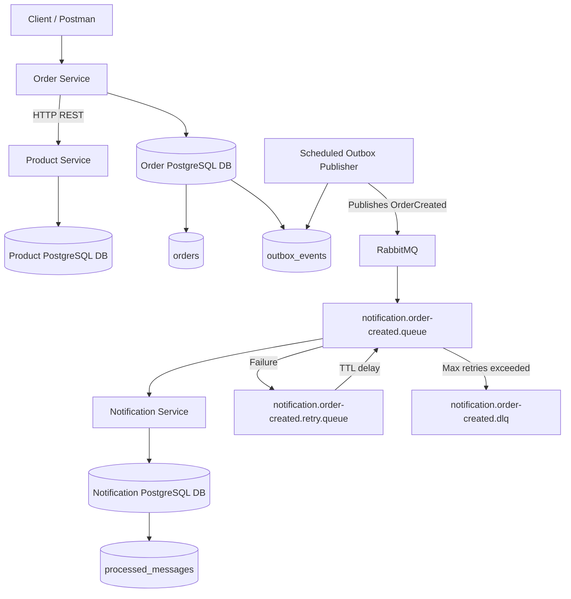

# Distributed Store

**Distributed Store** is a Spring Boot microservices project that demonstrates practical distributed systems patterns in a small e-commerce-style system.

The project is built around three services:

* **Product Service** — manages product catalogue and stock data.
* **Order Service** — creates customer orders and publishes domain events.
* **Notification Service** — consumes order events and processes notifications asynchronously.

This project goes beyond basic CRUD by implementing real-world backend patterns such as:

* service-to-service communication
* timeouts, retries, and circuit breakers
* asynchronous messaging with RabbitMQ
* retry queues and dead-letter queues
* idempotent message consumption
* the transactional outbox pattern
* manual replay of failed outbox events
* PostgreSQL persistence per service
* Docker-based local infrastructure

---

## Project Purpose

The purpose of this project is to demonstrate how distributed backend systems handle failure, retries, duplicate messages, and eventual consistency.

In a single-service application, saving an order and sending a notification can happen in one process. In a distributed system, those actions usually happen across different services, databases, and message brokers.

This project explores those challenges in a practical way.

---

## Architecture Overview



---

## Services

### Product Service

The Product Service owns product data.

Responsibilities:

* create products
* retrieve product details
* expose product price and stock quantity
* act as the source of truth for product catalogue information

Example product fields:

```text
id
name
price
stockQuantity
createdAt
updatedAt
```

---

### Order Service

The Order Service is responsible for order creation.

Responsibilities:

* receive order requests
* call Product Service to validate product details
* check available stock
* save order data
* save an outbox event in the same transaction
* publish pending outbox events to RabbitMQ
* expose admin/demo endpoints for failed outbox event replay

Key distributed systems patterns implemented here:

* synchronous HTTP communication
* timeout handling
* retries
* circuit breaker
* transactional outbox
* scheduled background publishing
* failed event replay

---

### Notification Service

The Notification Service consumes `OrderCreated` events from RabbitMQ.

Responsibilities:

* consume order-created events asynchronously
* simulate sending notifications
* avoid duplicate processing using idempotency
* retry temporary failures
* send permanently failed messages to a dead-letter queue

Key distributed systems patterns implemented here:

* RabbitMQ consumer
* retry queue
* dead-letter queue
* idempotent consumer
* processed message tracking

---

## Technology Stack

| Area               | Technology                                |
| ------------------ | ----------------------------------------- |
| Language           | Java 21                                   |
| Framework          | Spring Boot 3                             |
| Build Tool         | Maven                                     |
| Database           | PostgreSQL                                |
| Messaging          | RabbitMQ                                  |
| ORM                | Spring Data JPA / Hibernate               |
| Resilience         | Resilience4j                              |
| Containers         | Docker / Docker Compose                   |
| API Testing        | Postman                                   |
| Architecture Style | Microservices / Event-driven architecture |

---

## Core Distributed Systems Concepts Demonstrated

### 1. Service-to-Service Communication

Order Service calls Product Service synchronously over HTTP to validate product information before creating an order.

```text
Order Service → Product Service
```

This introduces typical distributed system risks:

* Product Service may be down
* Product Service may be slow
* network calls may timeout
* responses may fail intermittently

To handle this, Order Service uses:

* connection timeout
* read timeout
* retry
* circuit breaker

---

### 2. Retry and Circuit Breaker

Order Service uses Resilience4j to make Product Service calls more resilient.

If Product Service temporarily fails, Order Service retries the request.

If Product Service keeps failing, the circuit breaker opens and fails fast instead of repeatedly calling a broken dependency.

```text
CLOSED → normal calls
OPEN → fail fast
HALF_OPEN → test if dependency recovered
```

This protects Order Service from being dragged down by a failing downstream service.

---

### 3. Asynchronous Messaging with RabbitMQ

After an order is created, the system publishes an `OrderCreated` event.

Notification Service consumes that event asynchronously.

```text
Order Service → RabbitMQ → Notification Service
```

This decouples order creation from notification processing.

The customer order can be created without waiting for notification processing to complete.

---

### 4. Dead Letter Queue

If Notification Service cannot process a message successfully, the message is eventually moved to a dead-letter queue.

```text
notification.order-created.queue
   ↓ failure
notification.order-created.dlq
```

The DLQ acts as a safe parking area for messages that could not be processed.

---

### 5. Delayed Retry Queue

Instead of sending failed messages directly to the DLQ, the system first retries them after a delay.

```text
Main queue
   ↓ failure
Retry queue
   ↓ wait
Main queue again
```

This helps with temporary failures such as:

* temporary network issues
* email provider downtime
* short-lived database problems
* temporary downstream service failures

---

### 6. Idempotent Consumer

Message brokers can deliver the same message more than once.

To prevent duplicate notifications, Notification Service stores processed event IDs in a `processed_messages` table.

```text
Receive event
   ↓
Check eventId
   ↓
Already processed? Skip
   ↓
Not processed? Process and save eventId
```

This makes the consumer idempotent.

If the same event arrives again, it is safely ignored.

---

### 7. Transactional Outbox Pattern

A common distributed systems problem is:

```text
Order saved successfully
RabbitMQ publish fails
```

That would leave the system inconsistent because the order exists, but no event was published.

This project solves that using the Transactional Outbox Pattern.

Instead of publishing directly to RabbitMQ during order creation, Order Service saves the event into an `outbox_events` table in the same database transaction as the order.

```text
Save order
Save outbox event
Commit transaction
```

A scheduled publisher later reads pending outbox events and publishes them to RabbitMQ.

This guarantees:

```text
If the order exists, the event exists.
```

If RabbitMQ is down, the event remains safely stored as `PENDING` and can be published later.

---

### 8. Manual Replay of Failed Outbox Events

If an outbox event fails too many times, it is marked as `FAILED`.

The project includes a demo/admin endpoint to replay failed events.

```text
FAILED → replay → PENDING → PUBLISHED
```

This allows recovery without manually editing the database.

> Note: In a production system, this endpoint should be protected with admin authentication and auditing.

---

## Repository Structure

```text
distributed-store/
├── README.md
├── docker-compose.yml
├── common/
│   ├── pom.xml
│   └── src/
├── product-service/
│   ├── Dockerfile
│   ├── pom.xml
│   └── src/
├── order-service/
│   ├── Dockerfile
│   ├── pom.xml
│   └── src/
└── notification-service/
    ├── Dockerfile
    ├── pom.xml
    └── src/
```

---

## Local Infrastructure

The project uses Docker Compose for local infrastructure.

Infrastructure services:

* RabbitMQ
* Product PostgreSQL database
* Order PostgreSQL database
* Notification PostgreSQL database

RabbitMQ ports:

| Port  | Purpose                |
| ----- | ---------------------- |
| 5672  | AMQP messaging         |
| 15672 | RabbitMQ Management UI |

RabbitMQ Management UI:

```text
http://localhost:15672
```

Default local credentials:

```text
username: guest
password: guest
```

---

## Running Locally

### Prerequisites

Make sure you have the following installed:

* Java 21
* Maven
* Docker Desktop
* Git
* Postman or another API client

---

### 1. Clone the repository

```bash
git clone https://github.com/ssalidm/distributed-store.git
cd distributed-store
```

---

### 2. Start infrastructure

From the root folder:

```bash
docker compose up -d
```

This starts RabbitMQ and the PostgreSQL databases.

---

### 3. Start Product Service

```bash
cd product-service
mvn spring-boot:run
```

Default URL:

```text
http://localhost:8081
```

---

### 4. Start Order Service

Open a new terminal:

```bash
cd order-service
mvn spring-boot:run
```

Default URL:

```text
http://localhost:8080
```

---

### 5. Start Notification Service

Open another terminal:

```bash
cd notification-service
mvn spring-boot:run
```

Default URL:

```text
http://localhost:8082
```

---

## Environment Variables

### Product Service

```env
DB_HOST=localhost
DB_PORT=5433
DB_NAME=product_db
DB_USERNAME=postgres
DB_PASSWORD=postgres
```

### Order Service

```env
DB_HOST=localhost
DB_PORT=5432
DB_NAME=order_db
DB_USERNAME=postgres
DB_PASSWORD=postgres

PRODUCT_SERVICE_BASE_URL=http://localhost:8081

RABBITMQ_HOST=localhost
RABBITMQ_PORT=5672
RABBITMQ_USERNAME=guest
RABBITMQ_PASSWORD=guest

OUTBOX_PUBLISHER_FIXED_DELAY_MS=5000
OUTBOX_PUBLISHER_MAX_RETRY_ATTEMPTS=5
```

### Notification Service

```env
DB_HOST=localhost
DB_PORT=5434
DB_NAME=notification_db
DB_USERNAME=postgres
DB_PASSWORD=postgres

RABBITMQ_HOST=localhost
RABBITMQ_PORT=5672
RABBITMQ_USERNAME=guest
RABBITMQ_PASSWORD=guest
```

---

## API Examples

### Create Product

```http
POST http://localhost:8081/api/products
Content-Type: application/json
```

```json
{
  "name": "iPhone 17",
  "price": 24999.99,
  "sku": "APL-IP17",
  "stockQuantity": 14
}
```

---

### Get Product

```http
GET http://localhost:8081/api/products/{productId}
```

---

### Create Order

```http
POST http://localhost:8080/api/orders
Content-Type: application/json
```

```json
{
  "customerName": "John",
  "productId": "<product-id>",
  "quantity": 2
}
```

Expected behavior:

```text
1. Order Service calls Product Service
2. Product is validated
3. Order is saved
4. Outbox event is saved as PENDING
5. Scheduled publisher publishes event to RabbitMQ
6. Outbox event becomes PUBLISHED
7. Notification Service consumes the event
8. Processed event is stored for idempotency
```

---

### List Failed Outbox Events

```http
GET http://localhost:8080/api/outbox-events/failed
```

---

### Replay Failed Outbox Event

```http
POST http://localhost:8080/api/outbox-events/{eventId}/replay
```

This changes the event from:

```text
FAILED → PENDING
```

The scheduled publisher will then try publishing it again.

---

## Database Tables

### Order Service Database

Important tables:

```text
orders
outbox_events
```

The `outbox_events` table tracks events waiting to be published.

Example query:

```sql
SELECT event_id, event_type, status, retry_count, published_at
FROM outbox_events
ORDER BY created_at DESC;
```

Possible statuses:

| Status    | Meaning                                                 |
| --------- | ------------------------------------------------------- |
| PENDING   | Waiting to be published                                 |
| PUBLISHED | Successfully published to RabbitMQ                      |
| FAILED    | Failed too many times and requires replay/investigation |

---

### Notification Service Database

Important table:

```text
processed_messages
```

This table prevents duplicate message processing.

Example query:

```sql
SELECT event_id, event_type, source, processed_at
FROM processed_messages
ORDER BY processed_at DESC;
```

---

## Demo Scenarios

### Scenario 1: Happy Path

```text
RabbitMQ is running
Product Service is running
Order Service is running
Notification Service is running
```

Create an order.

Expected result:

```text
Order is created
Outbox event is saved
Event is published
Notification Service consumes event
processed_messages table is updated
```

---

### Scenario 2: RabbitMQ Down During Order Creation

Stop RabbitMQ:

```bash
docker compose stop rabbitmq
```

Create an order.

Expected result:

```text
Order is still created
Outbox event remains PENDING
Publisher retries and eventually marks it FAILED if RabbitMQ stays down
```

Start RabbitMQ:

```bash
docker compose start rabbitmq
```

Replay the failed event:

```http
POST http://localhost:8080/api/outbox-events/{eventId}/replay
```

Expected result:

```text
FAILED event becomes PENDING
Publisher publishes it
Event becomes PUBLISHED
Notification Service consumes it
```

---

### Scenario 3: Notification Consumer Failure

Temporarily make Notification Service throw an exception while processing a message.

Expected result:

```text
Message goes to retry queue
Message waits for TTL delay
Message returns to main queue
After max attempts, message goes to DLQ
```

RabbitMQ queues involved:

```text
notification.order-created.queue
notification.order-created.retry.queue
notification.order-created.dlq
```

---

### Scenario 4: Duplicate Message Delivery

Publish the same `OrderCreated` event more than once using the same `eventId`.

Expected result:

```text
First message is processed
Duplicate message is skipped
No duplicate notification is sent
```

Notification Service logs should show:

```text
Skipping duplicate OrderCreated event
```

---

## Resilience Features

| Problem                                    | Solution Implemented   |
| ------------------------------------------ | ---------------------- |
| Product Service slow or unavailable        | Timeout                |
| Temporary Product Service failure          | Retry                  |
| Repeated Product Service failure           | Circuit breaker        |
| RabbitMQ unavailable during order creation | Transactional outbox   |
| Message consumer failure                   | Retry queue            |
| Repeated message failure                   | Dead-letter queue      |
| Duplicate message delivery                 | Idempotent consumer    |
| Failed outbox event                        | Manual replay endpoint |

---

## Current Limitations

This project is intentionally focused on distributed systems learning. Some production concerns are simplified.

Current limitations:

* no authentication or authorization
* replay endpoint is not secured
* no stock reservation saga yet
* no centralized logging platform
* no distributed tracing with OpenTelemetry yet
* no Kubernetes deployment manifests yet
* no CI/CD pipeline yet
* no automated integration tests for RabbitMQ flows yet

---

## Planned Improvements

Future improvements include:

* Saga pattern for stock reservation and compensation
* Product stock reduction and release flow
* OpenTelemetry distributed tracing
* centralized logging with ELK or Grafana Loki
* Prometheus and Grafana metrics
* GitHub Actions CI pipeline
* integration tests with Testcontainers
* Kubernetes deployment
* secured admin endpoints
* Railway deployment for live demo

---

## Key Learning Outcomes

This project demonstrates understanding of:

* microservice boundaries
* synchronous vs asynchronous communication
* eventual consistency
* failure handling
* retry strategies
* message durability
* dead-letter queues
* idempotency
* transactional outbox
* operational replay
* service resilience

---

## Why This Project Matters

Distributed systems fail in many ways:

```text
Services go down
Networks timeout
Messages duplicate
Message brokers become unavailable
Consumers crash
Databases and brokers cannot share one transaction
```

This project demonstrates practical solutions to those problems using a small but realistic architecture.

It shows how to build services that do not only work when everything is perfect, but can also recover when parts of the system fail.

---

## Author

**David Ssali**

Backend developer focused on Java, Spring Boot, microservices, distributed systems, and cloud-native backend engineering.

GitHub: `https://github.com/ssalidm`

---

## License

This project is available for learning and portfolio demonstration purposes.
